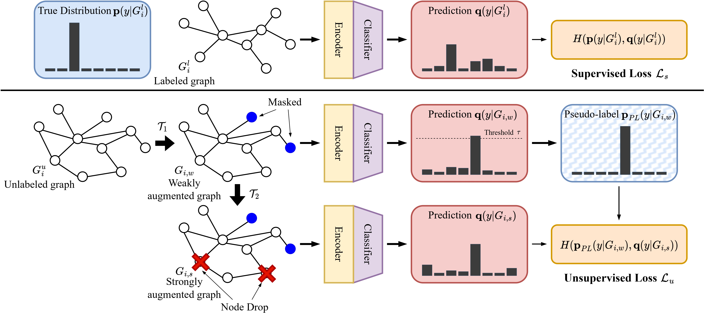
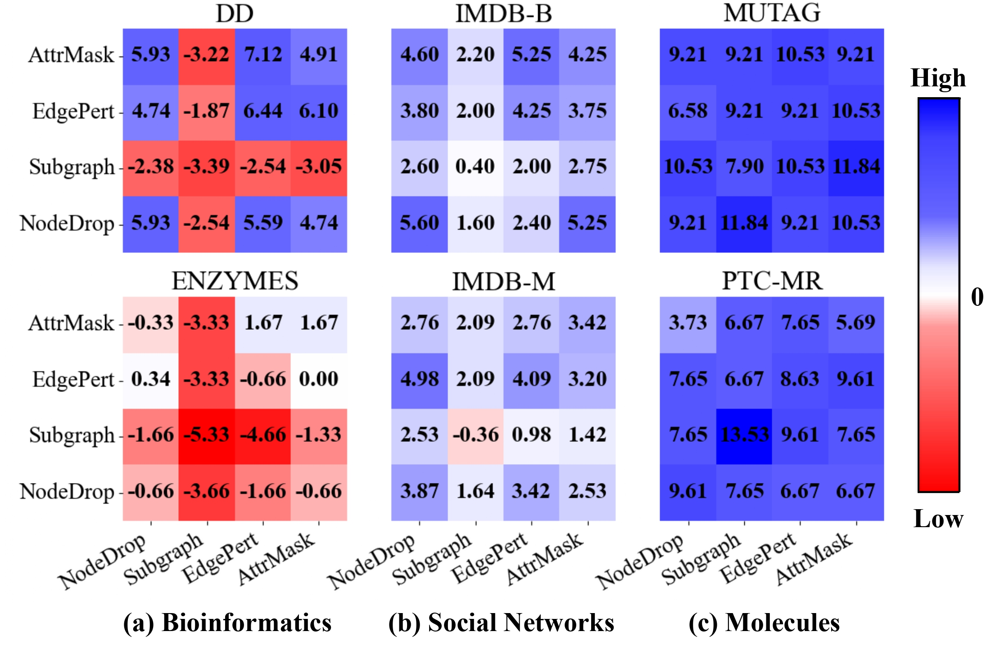

# Accurate Graph Classification via Consistency Regularization

This project is a PyTorch implementation of **"Accurate Graph Classification via Consistency Regularization"**.
This paper proposes CRAiG, an accurate semi-supervised graph classification framework.



To reproduce the underlying results, run `src/main.py` with different first and second augmentation pairs.



## Prerequisites

Our implementation is based on Python 3.9 and PyTorch Geometric.

- Python 3.9
- PyTorch 2.0.0
- PyTorch Geometric 2.3.1

PyTorch Geometric requires a separate installation process from the other
packages.

## Datasets

We utilize 7 datasets in our work on graph classification task, which are all from the [Datasets Source](https://chrsmrrs.github.io/datasets/).
The datasets could be easily downloaded by PyTorch Geometric.

| **Dataset** |  **Category**  | **Graphs** | **Nodes** | **Edges** | **Labels** |
|-------------|:--------------:|-----------:|----------:|----------:|-----------:|
| DD          | Bioinformatics | 1,178      | 284.32    | 715.66    | 2          |
| ENZYMES     | Bioinformatics | 600        | 32.63     | 62.14     | 6          |
| PROTEINS    | Bioinformatics | 1,113      | 39.06     | 72.82     | 2          |
| IMDB-B      | Social         | 1,000      | 19.77     | 96.53     | 2          |
| IMDB-M      | Social         | 1,500      | 13.00     | 65.94     | 3          |
| MUTAG       | Molecules      | 188        | 17.93     | 19.79     | 2          |
| PTC-MR      | Molecules      | 334        | 14.29     | 14.69     | 2          |

***Note: The values for Nodes and Edges are average values per each graph instance.***

### Code Description

This repository is written based on the codes from **"Model-Agnostic Augmentation for Accurate Graph Classification"** (WWW '22) \[[GitHub](https://github.com/snudatalab/GraphAug)\].
Here's an overview of our codes.

``` Unicode
CRAiG/
│
├── src/
│   ├── augment/
│   │   └── __init__.py               # codes for graph augmentation
│   │
│   ├── models/
│   │   └── gin.py                    # codes for GIN
│   │
│   ├── main.py                       # codes for running CRAiG
│   ├── data.py                       # codes for datasets
│   └── utils.py                      # frequently used code snippets
│
├── images/
│   ├── craig.jpg                     # the overall model
│   └── augmentation_type.jpg         # the influence of different augmentations
│
└── README.md

```
